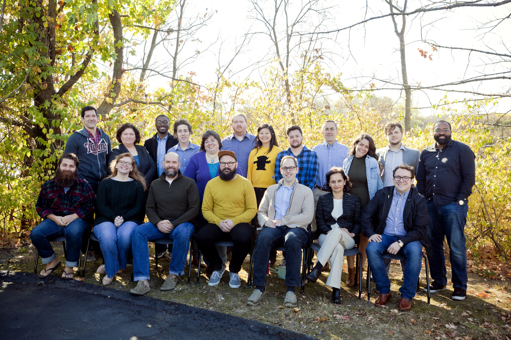

# Zach Parris Porfolio Website
## [zachparris.com](zachparris.com)  

### [NSS](http://nashvillesoftwareschool.com/) Evening Cohort 3  
##### Instructors - [Joe Shephard](https://github.com/JoeShep)(Front-End) and [Jurnell Cockhren](https://github.com/jcockhren)(Back-End)  
##### Advisors - [Kate Williams](https://github.com/katerebekah), [Zoe Ames](https://github.com/zoeames), [Blaise Gratton](https://github.com/blaisegratton) and [Greg Korte](https://github.com/gregkorte)  
***

PLease don't hesitate to reach out... I love telling my story and talking shop with like-minded thinkers!

Best,
Zach Parris
zachjparris@gmail.com

***

  <h3 align="center">Proud Member:</h3>
  

<!--
/////////////////////////////////  ATTRIBUTION  /////////////////////////////////

Theme used:
    Start Bootstrap - Creative

Creative is a one page creative theme for Bootstrap created by Start Bootstrap.

Download the latest release on Start Bootstrap
Clone the repo: git clone https://github.com/BlackrockDigital/startbootstrap-creative.git

Original Creator

Start Bootstrap was created by and is maintained by David Miller, Owner of Blackrock Digital.

https://twitter.com/davidmillerskt
https://github.com/davidtmiller
Start Bootstrap is based on the Bootstrap framework created by Mark Otto and Jacob Thorton.

Copyright and License

Copyright 2013-2016 Blackrock Digital LLC. Code released under the MIT license.
 -->
